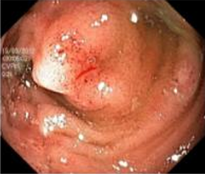
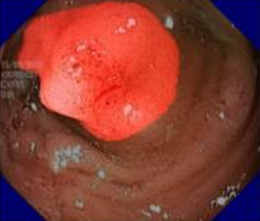

# Polyp Segmentation in Endoscopic Images


 


## Overview
This repository contains the code, models, and research documentation for automating polyp segmentation in gastrointestinal endoscopy images. Accurate and early detection of polyps is critical for the prevention of colorectal cancer. This project utilizes deep learning-based computer vision techniques to generate precise segmentation masks for medical image analysis.

## Research & Documentation

**Read the Full Paper:** Click the thumbnail below to view the full research paper directly in GitHub's native PDF viewer.

[](datacentric_polyp_segmentation.pdf)  

## Methodology & Architecture
* **Task:** Semantic Segmentation
* **Architecture:**  U-Net, ResUNet, Attention U-net
* **Loss Function:** Dice Loss, IoU
* **Data Processing:** The image preprocessing has been mentioned in the paper under the preprocessing section.

## 📊 Key Results
The model was evaluated using standard segmentation metrics:
* **Dice Coefficient:** `0.9525%`
* **Intersection over Union (IoU):** `0.9115`

### Visual Predictions
| Original Image | Ground Truth Mask | Modified Mask | Model Prediction |
| :---: | :---: | :---: | :---: |
|  |  |  |  |

## ⚙️ Installation & Usage

Since this is an archived research project, you can easily replicate the environment to run inference.

1. **Clone the repository:**
   ```bash
   git clone [https://github.com/yourusername/your-repo-name.git](https://github.com/yourusername/your-repo-name.git)
   cd your-repo-name
